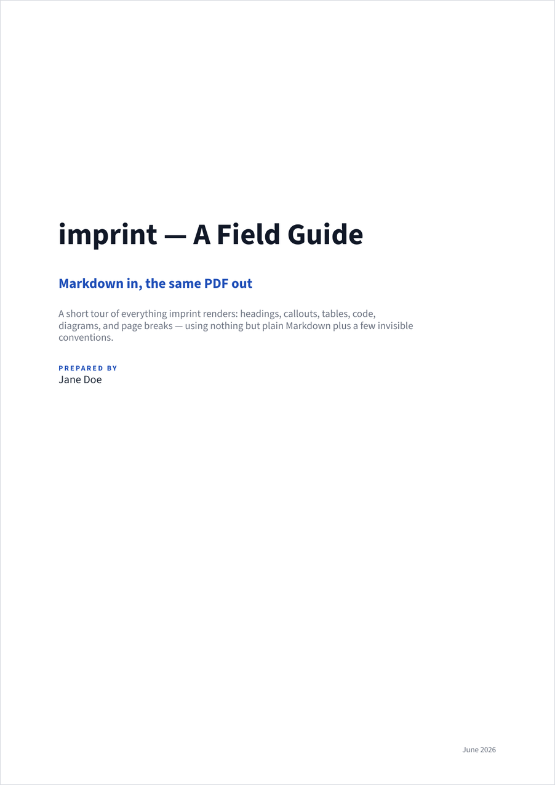
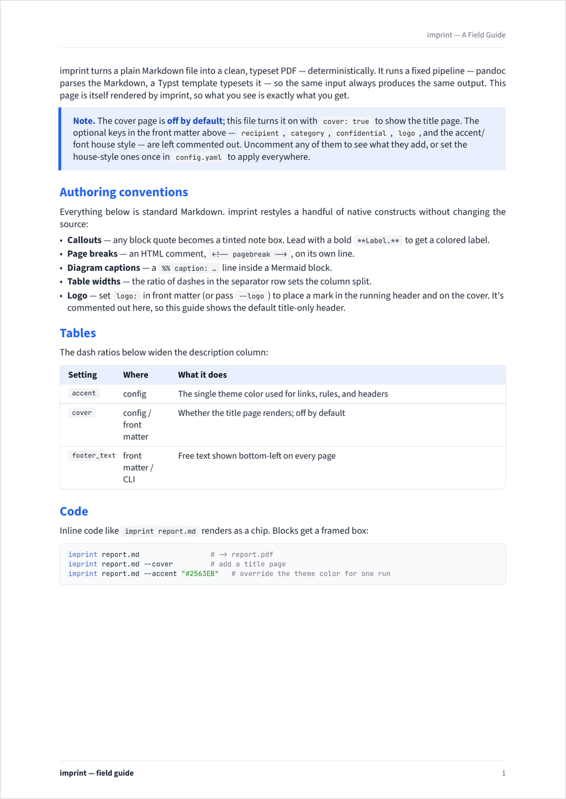
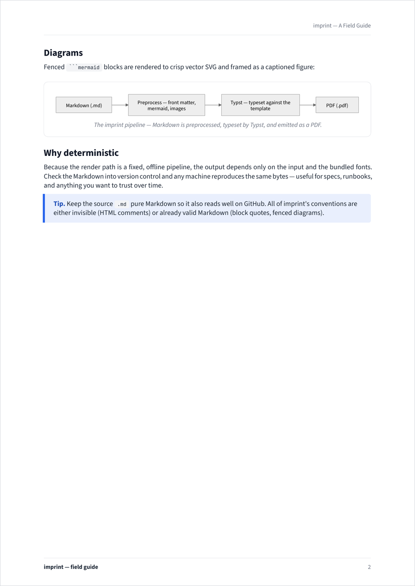
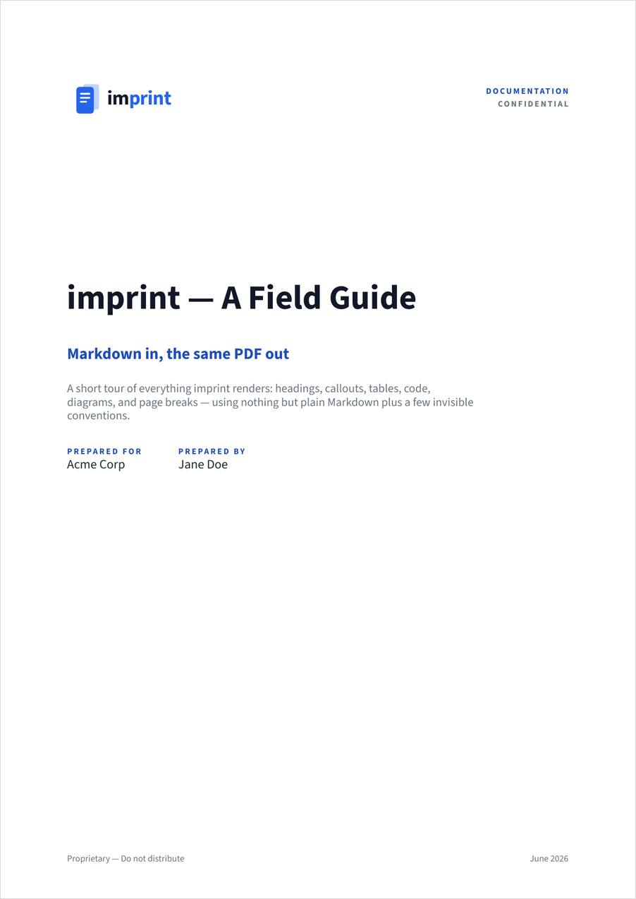
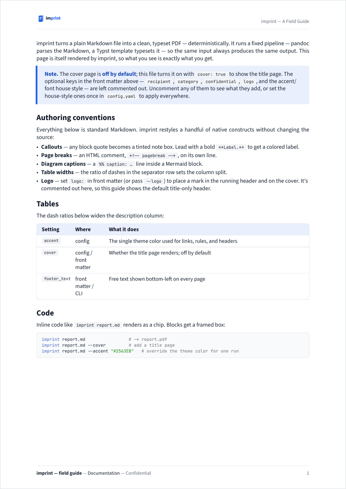
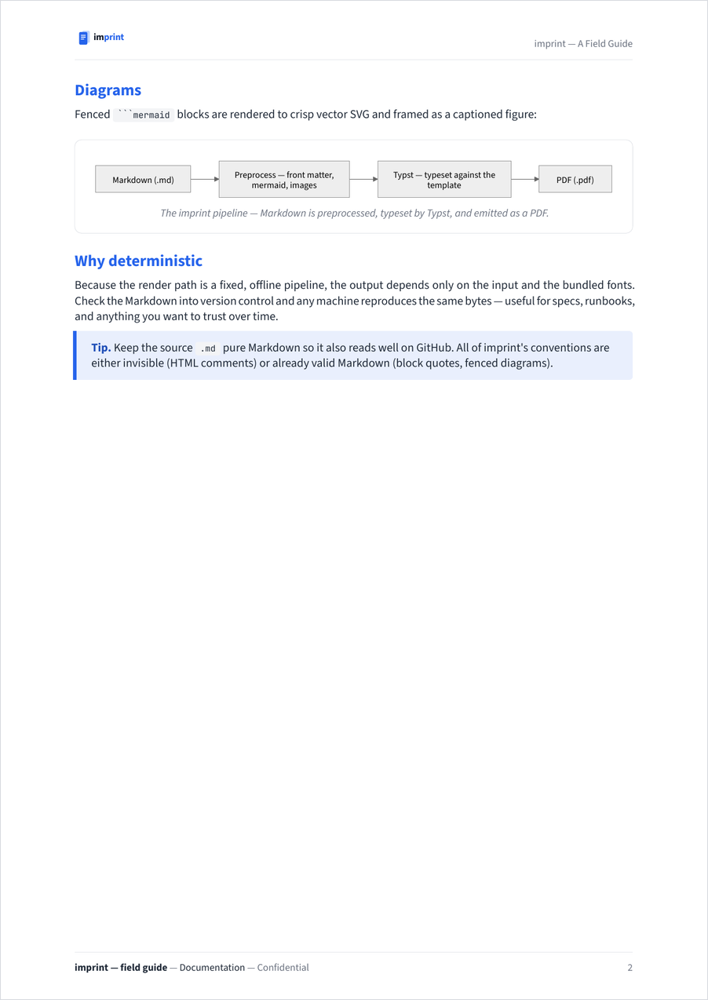
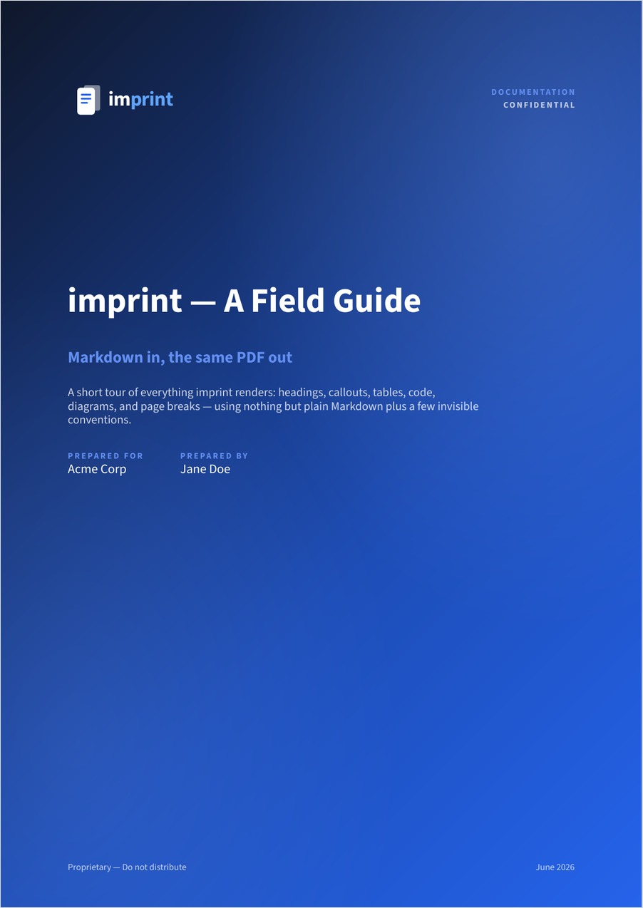
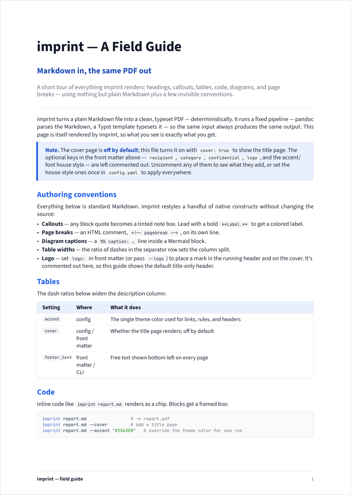

<!--
title: "imprint"
subtitle: "Branded, typeset documents from Markdown"
description: "Turn a Markdown file into a branded, typeset PDF — cover page, running header and footer, and a reusable house style — with one command."
category: "Documentation"
-->
# imprint

Turn Markdown into **branded, typeset PDFs** — the specs, design docs, and
reports that need to look official. One command gives you a title page, a running
header and footer, and a consistent house style, with your content flowed
straight through. Determinism is built in: a fixed pandoc → Typst pipeline means
the same input always produces the same PDF, on any machine.

imprint keeps two things apart. **How** a PDF is rendered — the theme accent,
fonts, your logo, and default toggles — lives in a small config file: a reusable
house style you point at any document. **What** a document says — its title,
author, footer name, recipient, and so on — lives in that document's front matter
(or a CLI flag). Set your brand once in config; each document overrides only what
it needs.

```bash
imprint report.md                      # -> report.pdf
imprint report.md --cover              # add a title page (off by default)
imprint report.md --accent "#2563EB"   # re-theme for one run
```

## What it looks like

Both rows below are the **same** [`examples/sample.md`](examples/sample.md)
rendered by imprint — left to right: the cover, a body page, and the diagram
page. The **top row** uses only the common front matter. The **bottom row** turns
on the optional cover fields — `recipient`, `category`, `confidential`, and
`logo` — which add the "Prepared for" line, the eyebrow + confidential marker, a
header/cover logo, and a confidential footer. Same Markdown, different switches.

| Cover | Body | Diagram |
|:-----:|:----:|:-------:|
|  |  |  |
|  |  |  |

The cover comes in two styles. The **light** cover (above) is the default; pass
`--gradient` (or `cover_style: gradient`) for a diagonal wash — a dark slate
anchor flowing into your theme color, with the subtitle and labels lifted into a
brighter accent. Change `accent` and the wash re-tints with the rest of the
document. A dark logo would vanish on it, so the gradient cover uses an optional
`logo_dark_bg` (a logo for dark backgrounds) and otherwise shows no cover logo.

| Light cover (default) | Gradient cover (`--gradient`) |
|:---------------------:|:-----------------------------:|
|  |  |

The cover itself is **off by default**. Without one, imprint opens the first page
with a **masthead** — the title, subtitle, and description as a title block over a
thin rule, with the content flowing straight after — and the running header picks
up from page 2. So a cover-less document still leads with a proper title, not just
the small header.

| Without cover — masthead (default) | With cover — title page |
|:----------------------------------:|:-----------------------:|
|  |  |

Regenerate these with `make preview` after a theme change.

## What you get

- **Clean body pages by default** — a Titled running header (an optional logo on
  the left, the document title on the right, over a thin rule) and a footer
  (optional footer text on the left, page number right). No cover unless you ask
  for one — instead the first page opens with a **masthead** (title, subtitle,
  description), and the running header begins on page 2.
- **Optional title page** — pass `--cover` (or `cover: true`) for a calm, light
  cover: title, subtitle, description, a `Prepared for / Prepared by` band, and
  an optional category eyebrow. Prefer something bolder? `--gradient` (or
  `cover_style: gradient`) swaps it for a dark accent wash with lifted-accent
  highlights.
- **Graphite + blue theme** — graphite body text, a single configurable accent (a
  professional technical blue by default) on headings, links, section dividers,
  table headers, and callouts. Change one value in config to re-tint the whole
  document.
- **Mermaid** ` ```mermaid ` blocks auto-rendered to crisp vector **SVG**,
  centered in a framed figure with an optional caption.
- **Callouts** — any Markdown block quote becomes a tinted note box.
- **Self-contained fonts** — Source Sans 3 (default) or IBM Plex Sans for
  body/headings, JetBrains Mono for code; all bundled and embedded, and rendering
  ignores system fonts, so output is identical on any machine.
- **Typeset with Typst** — a single static binary; deterministic, reproducible.

## Install

### One command

```bash
curl -fsSL https://raw.githubusercontent.com/gunasekar/imprint/main/install.sh | sh
```

Works on macOS and Linux. It clones imprint into `~/.local/share/imprint`, symlinks
the `imprint` command into `~/.local/bin`, scaffolds `~/.config/imprint/config.yaml`,
and checks your prerequisites (with OS-specific install hints for anything
missing). Re-run it anytime to update. Override locations with `IMPRINT_HOME` /
`IMPRINT_BIN`. It does **not** install the external tools below — install those
once with your package manager.

### Prerequisites

**macOS (Homebrew)**

```bash
brew install pandoc typst        # core
brew install mermaid-cli         # only if your docs use Mermaid (pulls in node)
```

**Linux**

```bash
# pandoc — distro packages are often older than the 3.x the Typst writer needs,
# so install the latest .deb/.tar.gz from https://github.com/jgm/pandoc/releases
cargo install --locked typst-cli           # typst (or a build from its GitHub releases)
npm install -g @mermaid-js/mermaid-cli      # only if your docs use Mermaid
```

Typst is also packaged for several distros (Arch, openSUSE, …) — check
[Repology](https://repology.org/project/typst/versions). `python3` and `bash`
ship on virtually every Linux box.

**Windows (WSL2)**

imprint is a Bash CLI, so it doesn't run natively in PowerShell or cmd. Use
[WSL2](https://learn.microsoft.com/windows/wsl/install) and follow the **Linux**
steps above inside your WSL distribution — everything works unchanged.

| Tool | Needed for | Notes |
|------|------|----------|
| `pandoc` ≥ 3.0 | always | Markdown parsing (Typst writer needs 3.x) |
| `typst` | always | single static binary; typesets the PDF |
| `mmdc` | docs with Mermaid | uses headless Chromium under the hood |
| `python3`, `bash` | always | stdlib only, no pip packages |

### From a clone

If you'd rather clone it yourself:

```bash
git clone https://github.com/gunasekar/imprint && cd imprint
make install   # symlink ./imprint onto PATH, then report prerequisite status
make config    # copy config.example.yaml -> ~/.config/imprint/config.yaml
make example   # render examples/sample.md -> examples/sample.pdf
```

Then edit `~/.config/imprint/config.yaml` with your preferred accent color.

## Configure rendering (config)

The config file holds your **house style** — the theme (accent, fonts), your logo,
and the default toggles. It's reusable branding you apply to every document: set
your accent, fonts, and logo here once and every PDF matches. Anything you set is
just a default — a single document overrides it in its own front matter (and
`accent` / `cover` / `--logo` / `--no-logo` can also be set with a CLI flag for one
run). It's looked up in this order (first found wins):

1. `$IMPRINT_CONFIG` — an explicit path
2. `~/.config/imprint/config.yaml` — recommended for an installed imprint
3. `./config.yaml` — repo-local (gitignored), handy while developing

See [`config.example.yaml`](config.example.yaml) for every key. All keys are
optional — imprint renders fine with no config at all (you get the neutral
defaults).

```yaml
accent:     "#2563EB"          # the single theme color
font_body:  "Source Sans 3"    # body + heading font — "Source Sans 3" or "IBM Plex Sans"
font_mono:  "JetBrains Mono"   # code font
logo:       "logo.svg"         # your brand mark — resolved relative to this config file
cover:      false              # title page off by default
```

A config `logo` path is resolved relative to **the config file** (keep the asset
beside it, or use an absolute path). Document-specific metadata — title, author,
footer text, recipient, … — does **not** go here; it lives in each document's
front matter (next section), which is also where you override or drop the logo
for one document (`logo: none`).

## Metadata: front matter or flags

Per-document metadata lives in **front matter** at the very top of the `.md`.
The preferred form is an HTML comment (invisible in every Markdown viewer);
a `--- … ---` YAML fence also works.

```markdown
<!--
title: "Q2 Architecture Review"
subtitle: "Managed-Kafka Rollout"
description: "How the platform ingests, validates, and routes events."
author: "Jane Doe"
footer_text: "Jane Doe"
category: "Engineering"
date: "June 2026"
recipient: "Acme Corp"
logo: "logo.png"
logo_height: 52
cover: true
confidential: false
-->
# Q2 Architecture Review
```

Every value resolves by precedence: **CLI flag > front matter > config > default**.
The first group below is **document metadata** (front matter / flags only); the
rest are **house-style settings** that default from config but can be overridden
per document.

| Key / flag | Default | Meaning |
|-------------|---------|------------------------------------------------|
| `title` / `--title` | first `# H1` | Document title (the H1 is stripped from the body unless `--keep-h1`) |
| `subtitle` / `--subtitle` | — | Shown under the title on the cover / masthead |
| `description` / `--desc` | — | One-line summary on the cover / masthead |
| `author` / `--author` | — | "Prepared by" on the cover; also the PDF author |
| `footer_text` / `--footer-text` | falls back to `author` | Free text, bottom-left of every page |
| `recipient` / `--recipient` | — | "Prepared for" on the cover |
| `date` / `--date` | — | Free-form date string (e.g. `June 2026`) |
| `category` / `--category` | — | Cover eyebrow + PDF keyword |
| `logo` / `--logo` / `--no-logo` | — (config) | Logo on the cover and running header. A config path resolves relative to the config file, a front-matter path relative to the `.md`; `logo: none` or `--no-logo` drops it |
| `logo_dark_bg` / `--logo-dark-bg` | — (config) | Logo for a dark background, used only on the **gradient** cover (the dark `logo` would vanish on the wash) |
| `logo_height` / `--logo-height` | `40` (config) | Cover logo height in pt (the running-header logo is always 2× the title text) |
| `accent` / `--accent` | `#2563EB` (config) | Theme color (any hex) |
| `cover` / `--cover` `--no-cover` | `false` (config) | Render the title page |
| `cover_style` / `--cover-style` `--gradient` | `light` (config) | Cover look: `light` or `gradient` (an accent wash). `--gradient` also turns the cover on |
| `confidential` / `--confidential` | `false` (config) | Adds a "Confidential" marker |

## Authoring conventions

The source `.md` stays pure Markdown — imprint never mutates it. A few native
constructs are restyled:

- **Callouts.** Any block quote becomes a tinted note box. Lead with a bold
  `**Label.**` to get a colored label.
- **Page breaks.** `<!-- pagebreak -->` on its own line forces a new page.
- **Diagram captions.** A `%% caption: …` line inside a ` ```mermaid ` block
  becomes the figure caption (and is stripped before rendering).
- **Table widths.** Every table spans the full page width; the *ratio* of dashes
  in the separator row sets how that width splits between columns.

## How it works

See [`docs/ARCHITECTURE.md`](docs/ARCHITECTURE.md) for the pipeline, the Typst
back-end, and the design tokens. Design rationale lives in
[`docs/decisions/`](docs/decisions/).

## License

MIT for the code. Bundled fonts (Source Sans 3, IBM Plex Sans, JetBrains Mono) are
under the SIL Open Font License — see [`assets/fonts/`](assets/fonts/).
