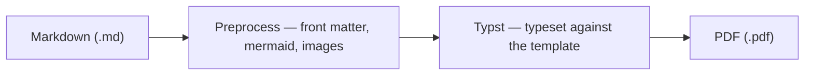

<!--
# Front matter = this document's own metadata. It lives in an HTML comment, so it
# stays invisible in any Markdown viewer (GitHub, VS Code) while imprint reads it.
#
# Precedence, highest wins:  CLI flag  >  front matter  >  config.yaml  >  default.
# config.yaml carries your house style (accent, fonts, default toggles) for every
# PDF you render; set a key here only when THIS document should differ.

# --- Commonly used: fill these in per document ---
title:        "imprint — A Field Guide"
subtitle:     "Markdown in, the same PDF out"
description:  "A short tour of everything imprint renders: headings, callouts, tables, code, diagrams, and page breaks — using nothing but plain Markdown plus a few invisible conventions."
author:       "Jane Doe"
date:         "June 2026"
footer_text:  "imprint — field guide"
cover:        true                 # title page; OFF by default — omit to start straight into content

# --- Optional: uncomment only if a document needs it ---
# recipient:    "Acme Corp"        # adds a "Prepared for" line on the cover
# category:     "Documentation"    # cover eyebrow + PDF keyword
# confidential: true               # stamps a "Confidential" marker on every page
# logo:         "logo.svg"         # cover + running-header mark (path relative to this .md)
# logo_height:  40                 # cover logo height, in pt

# --- House style: normally set once in config.yaml; override here only for a one-off look ---
# accent:       "#2563EB"          # the single theme color (links, rules, table headers)
# font_body:    "Source Sans 3"    # body + headings
# font_head:    "IBM Plex Sans"    # headings only (defaults to font_body)
# font_mono:    "JetBrains Mono"   # code
-->
# imprint — A Field Guide

imprint turns a plain Markdown file into a clean, typeset PDF — deterministically.
It runs a fixed pipeline — pandoc parses the Markdown, a Typst template typesets
it — so the same input always produces the same output. This page is itself
rendered by imprint, so what you see is exactly what you get.

> **Note.** The cover page is **off by default**; this file turns it on with
> `cover: true` to show the title page. The optional keys in the front matter
> above — `recipient`, `category`, `confidential`, `logo`, and the accent/font
> house style — are left commented out. Uncomment any of them to see what they
> add, or set the house-style ones once in `config.yaml` to apply everywhere.

## Authoring conventions

Everything below is standard Markdown. imprint restyles a handful of native
constructs without changing the source:

- **Callouts** — any block quote becomes a tinted note box. Lead with a bold
  `**Label.**` to get a colored label.
- **Page breaks** — an HTML comment, `<!-- pagebreak -->`, on its own line.
- **Diagram captions** — a `%% caption: …` line inside a Mermaid block.
- **Table widths** — the ratio of dashes in the separator row sets the column split.
- **Logo** — set `logo:` in front matter (or pass `--logo`) to place a mark in
  the running header and on the cover. It's commented out here, so this guide
  shows the default title-only header.

## Tables

The dash ratios below widen the description column:

| Setting | Where | What it does |
|--------|--------|-------------------------------------------------|
| `accent` | config | The single theme color used for links, rules, and headers |
| `cover` | config / front matter | Whether the title page renders; off by default |
| `footer_text` | front matter / CLI | Free text shown bottom-left on every page |

## Code

Inline code like `imprint report.md` renders as a chip. Blocks get a framed box:

```bash
imprint report.md                 # -> report.pdf
imprint report.md --cover         # add a title page
imprint report.md --accent "#2563EB"   # override the theme color for one run
```

<!-- pagebreak -->

## Diagrams

Fenced ` ```mermaid ` blocks are rendered to crisp vector SVG and framed as a
captioned figure:



## Why deterministic

Because the render path is a fixed, offline pipeline, the output depends only on
the input and the bundled fonts. Check the Markdown into version control and any
machine reproduces the same bytes — useful for specs, runbooks, and anything you
want to trust over time.

> **Tip.** Keep the source `.md` pure Markdown so it also reads well on GitHub.
> All of imprint's conventions are either invisible (HTML comments) or already
> valid Markdown (block quotes, fenced diagrams).
