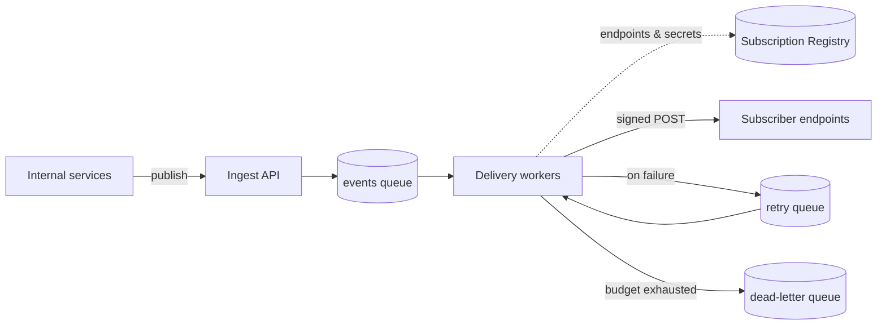
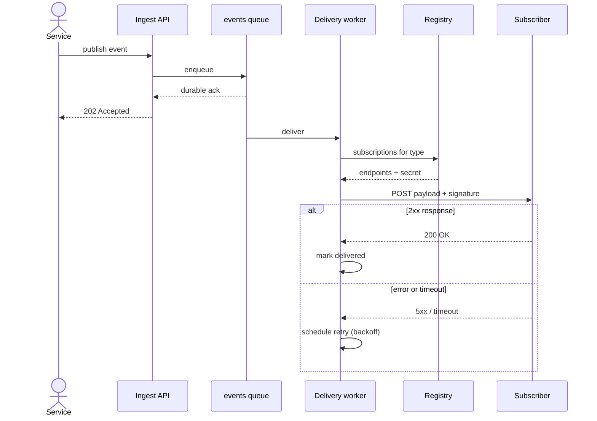

<!--
# Front matter — this document's own metadata. See the README section
# "Metadata: front matter or flags" for every key, and config.yaml for house
# style (accent, fonts, logo). This sample doubles as a render test: a believable
# design doc that exercises a gradient cover, two diagram types, tables, callouts,
# and a page break — nothing here is imprint-specific.
title:          "Switchboard — Webhook Delivery Service"
subtitle:       "v2 — At-least-once delivery with retries"
description:    "How Switchboard accepts internal events and delivers them as signed webhooks to subscriber endpoints — with retries, exponential backoff, and a dead-letter queue."
author:         "Platform Team"
footer_text:    "Switchboard"
date:           "June 2026"
category:       "Engineering"
cover:          true
cover_style:    gradient
confidential:   true
-->
# Switchboard — Webhook Delivery Service

> **Purpose.** Switchboard is the service that turns internal domain events into
> outbound **webhooks**: other teams publish an event once, and Switchboard
> delivers it as a signed HTTP request to every endpoint subscribed to that event
> type. This document covers the **v2** design — how an event travels from publish
> to delivery, how failures are retried, and how a subscriber proves a request is
> genuine.

**Scope:** v2 only — the queue-backed delivery workers. The legacy v1 (synchronous, in-request) delivery path is out of scope.

---

## 1. At a glance

A publisher hands Switchboard an event and is done. Everything after that — fan-out
to subscribers, retries, signing — is Switchboard's responsibility, and none of it
blocks the publisher.

| Component | Runs on | Responsibility |
|----------|--------------|---------------------------------------------|
| **Ingest API** | API Gateway + Lambda | Authenticate the publisher, validate the envelope, and durably enqueue the event |
| **Events queue** | Managed queue | Decouple publish from delivery so a slow subscriber can never back-pressure a publisher |
| **Subscription Registry** | Postgres | Which endpoints want which event types, plus each endpoint's signing secret |
| **Delivery workers** | ECS Fargate | Sign and POST each event, interpret the response, and schedule retries on failure |
| **Dead-letter queue** | Managed queue | Events that exhausted their retry budget, kept for inspection and manual replay |

Publishers hold exactly one contract: the publish endpoint and an event-type name.
Who consumes an event — and how many subscribers there are — can change without any
publisher ever knowing.

> **What a publisher sees:** a single call and a `202 Accepted` once the event is
> durably enqueued. Delivery happens asynchronously, so adding a subscriber or a
> slow endpoint never changes how fast `publish` returns.

<!-- pagebreak -->

## 2. Architecture — where an event lives

Almost everything is a queue and the workers that drain it. The Subscription
Registry is the one piece of shared state every delivery reads.

The workers are stateless beyond their queue position, so they scale horizontally
just by adding Fargate tasks — delivery throughput is a function of worker count,
not of any single subscriber's speed.

## 3. Delivering one event — end-to-end

One event, one delivery attempt per subscriber. The Ingest API acknowledges as soon
as the event is durable; everything else is the worker's job, and a failing
subscriber only ever affects its own deliveries.

Each subscriber is delivered independently: one endpoint returning `500` never holds
up delivery to the others, and never affects the publisher.

<!-- pagebreak -->

## 4. Retries and backoff

A failed delivery is retried on a widening schedule. After the last attempt the
event moves to the dead-letter queue — it is never dropped silently.

| Attempt | Wait before it | Typical cause it absorbs |
|--------|--------------|-------------------------------------------------|
| 1 | immediate | a single dropped connection |
| 2 | 30 seconds | a brief subscriber restart |
| 3 | 2 minutes | a short deploy or rollout |
| 4 | 10 minutes | a transient dependency outage |
| 5 | 1 hour | a longer incident on the subscriber's side |
| — | dead-letter | the subscriber has been down for hours |

> **Note.** Retries are per subscriber, not per event. If three of four endpoints
> accept an event immediately, only the fourth is retried — the others are already
> marked delivered and are never re-sent.

Because a worker commits its queue position only after recording the delivery
outcome, a worker that crashes mid-batch resumes without re-sending anything it had
already confirmed — at-least-once delivery, with the subscriber expected to
de-duplicate on the event ID.

## 5. Operational notes

A few things worth knowing before you publish to or subscribe to Switchboard.

### 5.1 Adding a subscription

A subscription is a row in the Registry: an endpoint URL, the event types it wants,
and a freshly generated signing secret. Workers pick it up on their next registry
refresh, so onboarding a subscriber needs no deploy and no publisher-side change.

### 5.2 Verifying a request

Every request carries an `X-Switchboard-Signature` header — an HMAC of the raw body
keyed with the subscription's secret. A subscriber recomputes the HMAC and compares;
a mismatch means the request did not come from Switchboard.

> **Before you trust a payload:** verify the signature against the **raw** body,
> before any JSON parsing or re-serialization. Parsing and re-encoding can change a
> byte — a re-encoded body will fail the check even when the request is genuine.
